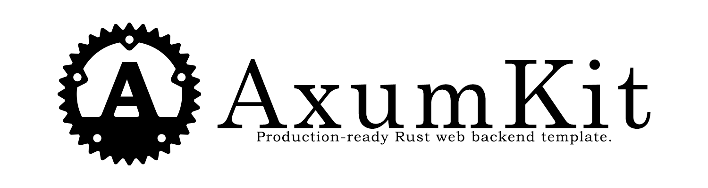

<p align="center">
  
</p>

# AxumKit
Production-ready Rust web backend template.

## Features

- **Auth**:Session (Redis), email/password (Argon2), OAuth2 (Google, GitHub), TOTP 2FA
- **Users & Posts**:Profiles, image uploads (R2), CRUD with ownership
- **Search**:Full-text via MeiliSearch, auto-indexed by worker
- **Background Jobs**:NATS JetStream worker (email, indexing, cleanup, cron)
- **Email**:SMTP templates (Lettre + MRML + MiniJinja)
- **Rate Limiting**:Sliding window (Redis Lua), per-route
- **API Docs**:Auto-generated Swagger UI (debug builds)
- **Deploy**:Docker multi-stage, GitHub Actions CI/CD

## Quick Start

```bash
git clone https://github.com/levish0/AxumKit.git && cd AxumKit
cp .env.example .env  # edit with your config

just up-infra
just migrate
cargo run -p server   # API server
cargo run -p worker   # worker (separate terminal)
```

## Project Structure

```
crates/
├── server             # API (handlers → services → repositories → entities)
├── worker             # Background jobs (NATS consumers, cron)
├── config             # Env config
├── constants          # Shared constants
├── dto                # Request / response types
├── entity             # SeaORM models
├── errors             # Centralized error handling
├── e2e                # Black-box end-to-end tests
└── migration          # DB migrations
```

## Configuration

Host `cargo run` loads `.env`. Docker Compose loads concern-grouped files in
[`.envs`](.envs/README.md). Copy `.envs/.example` to `.envs/.local` for local
containers, and run `just e2e` for the disposable test stack.

## License

[MIT](LICENSE)
